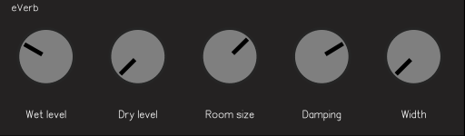

# eVerb
A very simple reverb that uses `juce::Reverb` for the business end.



## Parameters

- **Wet Level:** The effect level.
- **Dry Level:** The original audio level.
- **Room size:** Affects the decay time of the reverb.
- **Damping:** Damp reflections.
- **Width:** Stereo spread... I guess.

## Build

```sh
meson setup build
meson compile -C build
meson install -C build --skip-subprojects
```
